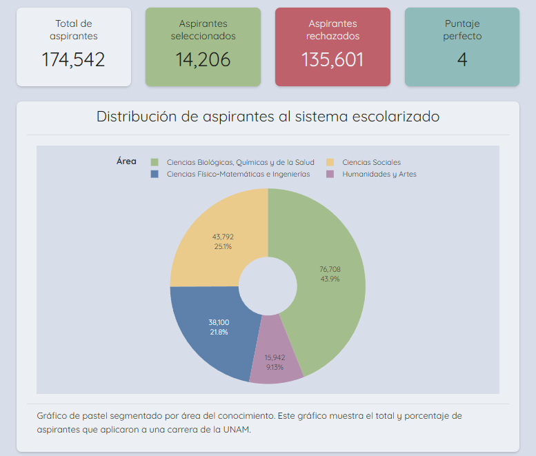
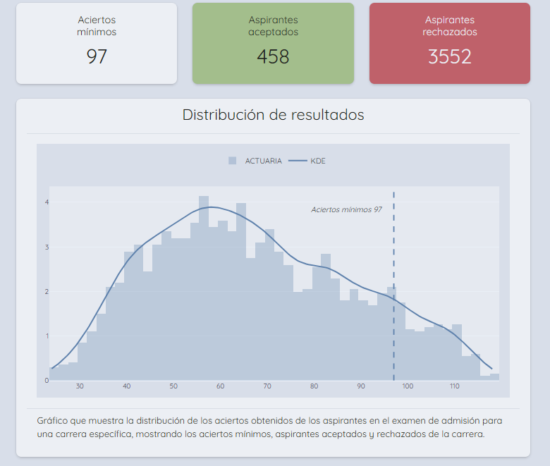
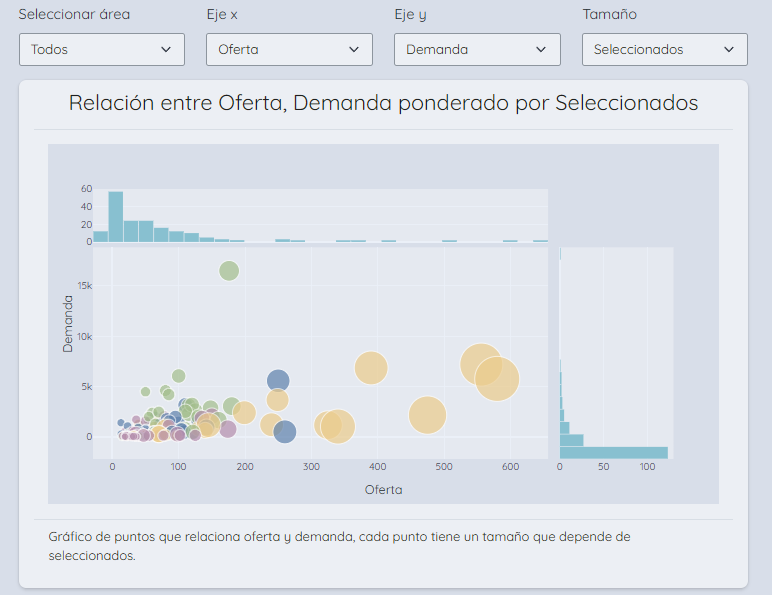

# Visualizador de datos del examen de admisión de la *UNAM*

Proyecto de análisis de datos desarrollado en Python para analizar los resultados obtenidos por aspirantes de ingreso a una licenciatura de la Universidad Nacional Autónoma de Méxicom, en el sistema escolarizado. Accede al visualizador haciendo click [aquí](https://ricardo-martinez-fismat.shinyapps.io/visualizador-de-resultados-unam/)

Este proyecto comprende desde el web-scraping para la recolección de datos en las páginas oficiales de la UNAM, limpieza, procesamiento de datos y desarrollo de la app-web del visualizador.

## Descripción general

### Sobre la obtención de los datos

Los datos fueron obtenidos de páginas oficiales de la *UNAM*, los datos fueron obtenidos de las siguientes páginas: 

1. [Resultados área 1](https://www.dgae.unam.mx/Licenciatura2025/resultados/15.html) 
2. [Resultados área 2](https://www.dgae.unam.mx/Licenciatura2025/resultados/25.html)
3. [Resultados área 3](https://www.dgae.unam.mx/Licenciatura2025/resultados/35.html)
4. [Resultados área 4](https://www.dgae.unam.mx/Licenciatura2025/resultados/45.html).
5. [Oferta de lugares](https://www.dgae.unam.mx/Licenciatura2025/oferta_lugares/oferta_licenciatura2025.html).

Puedes consultar los scripts del scraping en los archivos [`scraping_oferta_2025.py`](.//scraping/scraping_oferta_2025.py), [`scraping_puntaje.py`](./scraping/scraping_puntaje.py) y [`scraping_carreras_desc.py`](./scraping/scraping_carreras_desc.py)

### Sobre el visualizador de resultados

El visualizador está desarrollado en python usando el framework *Shiny*. El objetivo de este visualizador es mostrar de manera interactiva un análisis sobre los resultados de obtenidos por los aspirantes de ingreso a la una de las carreras impartidas por la *UNAM*, para comparar la diferencia de los aspiranteS que logran ingresar y aquellos que no.

Por el momento este visualizador esta enfocado en los resultados obtenidos del año 2025 en la primera vuelta. En caso de encontrar los datos de años anteriores se actualizará el visualizador.

Las siguiente imágenes son una muestra del visualizador:

 </img>

 </img>

 </img>

## Consideraciones legales y éticas

Los datos extraídos por estos scripts provienen de páginas públicas del sitio oficial de la DGAE-UNAM.

Si la institución considera que este repositorio incumple sus políticas, el contenido será retirado o ajustado según se solicite.
